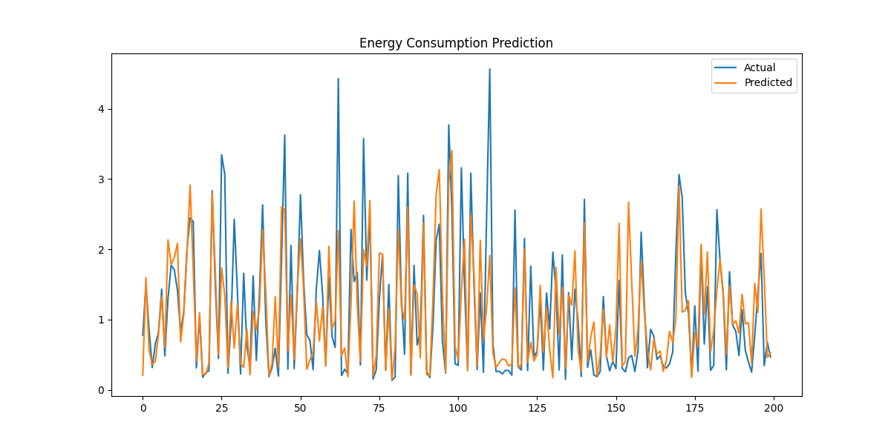
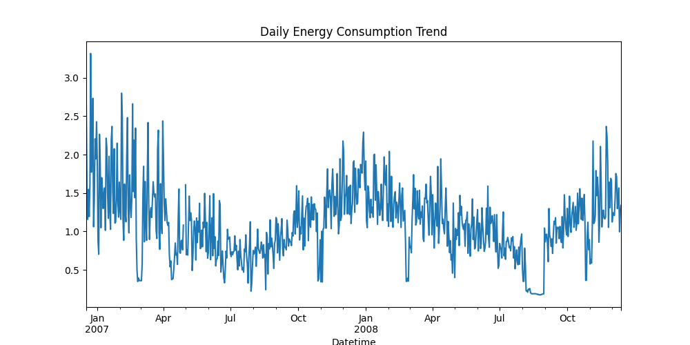

# AI Energy Consumption Forecasting System

## About the Project

This project focuses on predicting household electricity consumption using machine learning. The aim was to build a system that not only predicts usage but also helps understand patterns and provide simple, practical insights.

---

## Features

* Predicts electricity consumption using historical data
* Uses time-based features such as hour, day, and previous usage
* Compares predicted values with actual values
* Provides basic recommendations based on usage levels
* Predicts the next hour’s electricity consumption
* Displays trends to understand usage patterns over time

---

## Tools and Technologies

* Python
* Pandas, NumPy
* Scikit-learn
* Matplotlib

---

## Dataset

The project uses a household electricity consumption dataset containing date, time, and power usage information.

---

## How to Run

1. Upload the dataset (zip file)
2. Run the Python file
3. The system will:

   * Train the model
   * Generate predictions
   * Display graphs
   * Provide usage insights

---

## Output

* Model performance metrics (MAE, RMSE)
* Graph comparing actual and predicted values
* Usage recommendations
* Future consumption prediction
* Daily trend visualization

---

## Sample Output

### Prediction vs Actual

### Trend Analysis

---

## Key Insight

This project demonstrates how machine learning can be applied to real-world problems such as monitoring and optimizing electricity usage.
